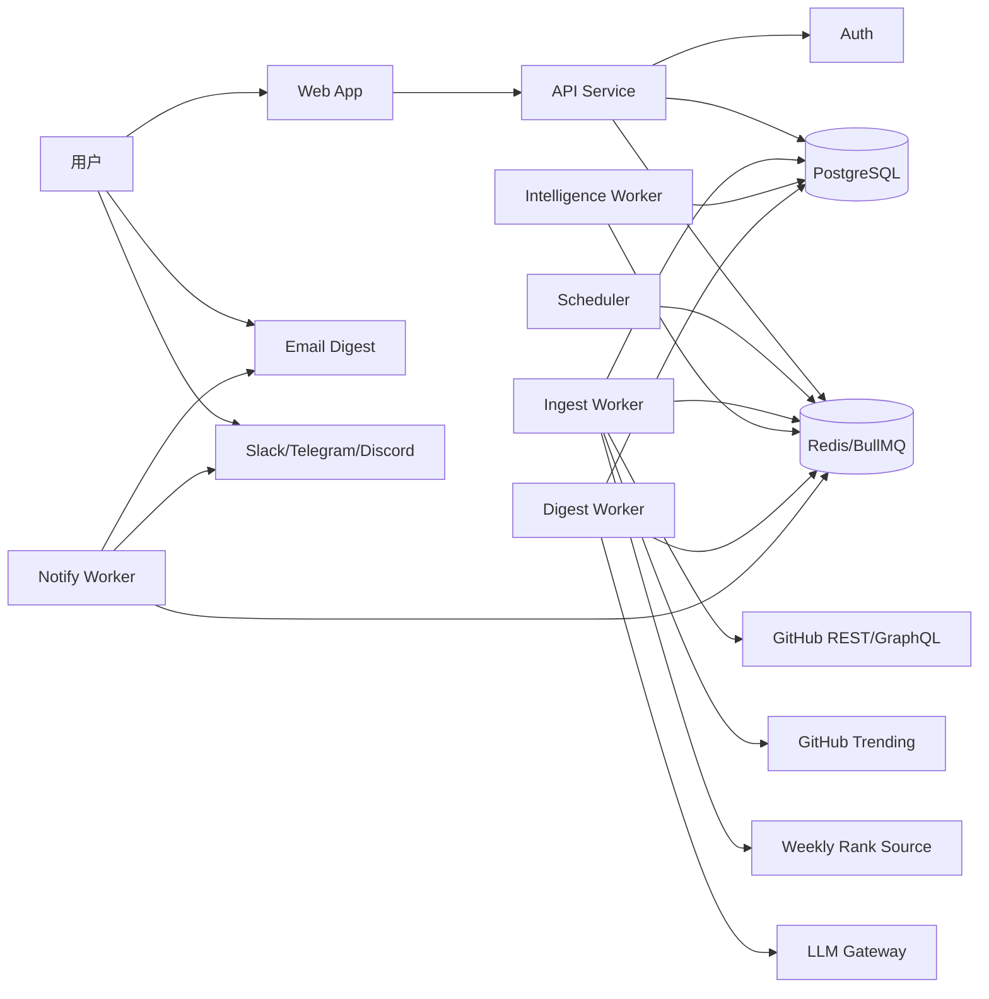
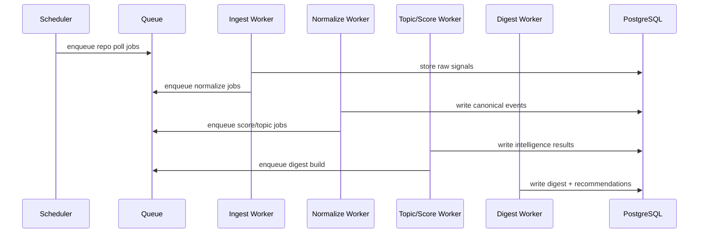

# GitHub 监控聚合 Agent｜系统模块图文档

## 1. 文档目的

本文档用于把产品 PRD 与里程碑路线图，落成一套可实施的 Node.js 技术架构蓝图。  
重点回答三个问题：

1. 系统按什么模块拆
2. 各模块边界与职责是什么
3. 这些模块如何组合成一个可运行、可演进的完整产品

---

## 2. 设计目标

系统最终要支持以下完整产品能力：

- RepoWatch：关注单仓或多仓变化
- TopicWatch：按主题聚合跨仓库信号
- TrendWatch：跟踪 GitHub Trending 等趋势榜单
- RankFeedWatch：接入外部周榜等聚合源
- Digest：生成日报、周报、月报
- Ask：围绕历史与证据链进行追问
- Personalization：基于反馈持续优化排序与推荐
- Collaboration：团队共享 watch、点评、分发、行动闭环
- Platformization：后续支持 GitHub App、私有仓库、更多源接入

---

## 3. 架构原则

### 3.1 领域先于服务
先按业务领域划边界，再决定物理部署单元；避免一开始为了“微服务感”而拆碎。

### 3.2 Raw / Canonical / Intelligence / Product 分层
- Raw：外部原始信号
- Canonical：统一事件事实层
- Intelligence：主题、趋势、评分、推荐等中间结果
- Product：日报、历史、反馈、通知、追问

### 3.3 Async-first
核心业务以任务链为主，不以同步 HTTP 为主。  
同步 API 主要服务于 UI、配置、查询、反馈、追问入口。

### 3.4 LLM 只做表达层
LLM 不直接作为事实源。  
事实由 canonical / intelligence 层提供，LLM 只负责压缩、解释、组织叙事。

### 3.5 可重放、可追溯、可幂等
- 原始信号可回放
- 重要结论可追溯到证据
- 各任务支持重复执行与幂等

---

## 4. 系统上下文图



---

## 5. 逻辑模块拆分

## 5.1 Watch Management

### 职责
- 管理 RepoWatch / TopicWatch / TrendWatch / RankFeedWatch
- 管理优先级、标签、关注频率、时间窗口
- 管理系统模板 watch 包

### 输入
- 用户配置
- 产品默认模板
- 历史反馈

### 输出
- watch target
- watch rule
- watch schedule
- watch priority

### 边界
不负责采集、摘要、趋势分析，只负责“定义看什么”。

---

## 5.2 Source Acquisition

### 职责
- GitHub repo polling
- webhook ingestion（后期）
- trending 抓取
- weekly rank 抓取
- source cursor / ETag / last_seen 管理

### 输入
- watch target
- schedule job
- source credentials / token policy

### 输出
- raw signal
- raw snapshot
- source cursor update

### 边界
不做主题归并、不做排序、不做摘要。

---

## 5.3 Canonical Event

### 职责
- 把原始信号翻译成统一事件
- 归一化实体
- 去重
- 维护事件与实体关系

### 典型事件
- `pr_opened`
- `pr_merged`
- `issue_opened`
- `issue_hot`
- `release_published`
- `repo_entered_trending`
- `rank_moved_up`
- `proposal_discussed`

### 边界
只定义“发生了什么”，不定义“重要不重要”。

---

## 5.4 Topic Intelligence

### 职责
- 维护 topic graph
- 将多个 repo / notes / agendas / spec / tests 归并到 topic
- 产出 topic evidence 与 topic update

### 典型场景
- TC39 proposal 跟踪
- Node 某能力方向跟踪
- AI Agent 方向跟踪

### 边界
不负责 UI 展示，不直接面向用户输出富文本；输出的是结构化 intelligence。

---

## 5.5 Trend Intelligence

### 职责
- 管理 trending snapshot
- 生成 daily diff
- 做榜单聚类
- 结合 weekly rank 提供强/弱趋势判断

### 边界
处理 snapshot + diff，而不是 repo event stream。

---

## 5.6 Scoring & Recommendation

### 职责
- 重要性评分
- 去噪与折叠
- 推荐阅读候选生成
- 个性化重排

### 评分维度
- 事件类型
- 影响范围
- 讨论热度
- 用户兴趣贴合
- 噪声惩罚

### 边界
不负责最终叙事文案，但负责“排什么”。

---

## 5.7 Digest Composition

### 职责
- 生成 deterministic digest skeleton
- 调用 LLM 做结构化润色
- 保存 digest / section / recommended items
- 生成邮件、站内、Bot 输出版本

### 输出
- daily digest
- weekly digest
- monthly digest

### 边界
不直接读外部源；只消费上游 intelligence 结果。

---

## 5.8 Ask & Retrieval

### 职责
- 基于 digest/history/evidence 做检索
- 组装回答上下文
- 输出可追溯回答

### 典型问题
- 这个 proposal 最近 7 天有哪几次推进？
- 今天最值得看的 3 个 PR 是什么？
- 某方向最近是否持续升温？

### 边界
不代替原始 intelligence 计算；只在已有知识上做 retrieval + composition。

---

## 5.9 Feedback & Personalization

### 职责
- 接收“值得/不值得/多推荐/少推荐”
- 更新偏好画像
- 调整排序权重
- 记录显式与隐式行为信号

### 边界
不是独立推荐系统，而是服务于排序与摘要质量优化。

---

## 5.10 Notification & Delivery

### 职责
- 邮件推送
- Slack/Telegram/Discord 推送
- 站内通知
- 定时和事件型发送策略

---

## 5.11 Operations & Governance

### 职责
- 定时任务调度
- 队列监控
- 限流与熔断
- 日志、指标、追踪
- 审计与配置管理

---

## 6. 物理部署建议

## 6.1 Deployable Units

### `apps/web`
- Next.js
- Today / Watches / Topics / Trends / History / Ask 页面
- 尽量薄，不承载核心 pipeline

### `apps/api`
- Fastify
- 用户鉴权
- watch 管理
- digest / history / ask / feedback API
- Webhook 接入入口（后期）

### `apps/scheduler`
- 负责 cron 与 schedule 触发
- 只负责派发任务，不做重活

### `apps/worker`
- 统一任务执行器
- 按 queue / handler 分职责
- 后期可按 ingest / intel / digest / notify 拆实例

### `packages/infra-llm`
- 统一 prompt、模型调用、缓存、fallback

---

## 7. Monorepo 建议结构

```text
/apps
  /web
  /api
  /scheduler
  /worker

/packages
  /domain-watch
  /domain-source
  /domain-canonical
  /domain-topic
  /domain-trend
  /domain-score
  /domain-digest
  /domain-ask
  /domain-feedback

  /infra-db
  /infra-queue
  /infra-github
  /infra-scraper
  /infra-llm
  /infra-observability

  /shared-types
  /shared-config
  /shared-utils
```

---

## 8. 关键调用链路

## 8.1 RepoWatch 日报链路



---

## 8.2 TopicWatch 链路

```text
watch target
  -> raw signals from multiple repos/sources
  -> canonical events
  -> topic match rules
  -> topic evidence
  -> topic update
  -> digest section / ask retrieval
```

---

## 8.3 TrendWatch 链路

```text
daily snapshot
  -> store snapshot items
  -> compare with yesterday
  -> rank up/down, new/left entries
  -> cluster by theme
  -> trend digest section
```

---

## 9. 技术栈建议

## 后端
- Node.js
- TypeScript
- Fastify
- Zod
- Pino

## 前端
- Next.js
- React
- TanStack Query
- Zustand 或 Context（轻状态）

## 数据层
- PostgreSQL
- Redis
- BullMQ

## GitHub 接入
- Octokit
- REST + GraphQL 混合

## 观测
- OpenTelemetry
- Prometheus / Grafana
- Sentry

---

## 10. 非功能设计映射

| 需求 | 设计落点 |
|---|---|
| 可重放 | raw_signal / raw_snapshot 持久化 |
| 可追溯 | digest -> recommended_item -> evidence 链接 |
| 幂等 | 每个 job 有唯一幂等键 |
| 限流感知 | GitHub access governor |
| 可扩展 | 逻辑多域，物理少服务 |
| 可运维 | metrics、job logs、DLQ、retry policy |
| 长期演进 | raw/canonical/intelligence/product 分层 |

---

## 11. 关键 ADR 列表

1. 运行时基线：Node.js + TypeScript + ESM
2. 架构风格：逻辑按领域拆，物理少服务，异步优先
3. 数据策略：PostgreSQL 主库 + Redis 队列
4. GitHub 接入：public source poll-first；owned/app-installed source webhook-first
5. 摘要策略：deterministic skeleton first，LLM second
6. 个性化策略：显式配置与反馈优先，学习排序后置

---

## 12. 当前建议的下一步

本模块图文档之后，下一步通常进入：

1. 数据表草案
2. 队列任务目录
3. 接口契约与 internal event schema
4. NFR / observability 设计
